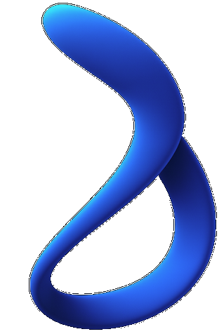

<p align="center">
  
</p>

<h1 align="center">BETACLARITY</h1>

<p align="center">
  <strong>Medical image super-resolution and denoising powered by latent diffusion.</strong><br>
  Train, enhance, and visualize — from Python SDK to full-stack web interface.
</p>

<p align="center">
  <a href="https://github.com/odaxai/BETACLARITY/actions/workflows/ci.yml"></a>
  <a href="https://github.com/odaxai/BETACLARITY/actions/workflows/docker-publish.yml"></a>
  <a href="https://github.com/odaxai/BETACLARITY/blob/main/LICENSE"></a>
  <a href="https://huggingface.co/OdaxAI/betaclarity-betasr"></a>
  <a href="https://hub.docker.com/r/odaxai/betaclarity"></a>
</p>

<p align="center">
  <strong><a href="https://odaxai.com">odaxai.com</a></strong>&ensp;|&ensp;<strong>&copy; 2026 OdaxAI SRL &middot; All rights reserved</strong>
</p>

<p align="center">
  <a href="#demo">Demo</a>&ensp;&bull;&ensp;
  <a href="#key-innovations">Key Innovations</a>&ensp;&bull;&ensp;
  <a href="#quick-start">Quick Start</a>&ensp;&bull;&ensp;
  <a href="#models">Models</a>&ensp;&bull;&ensp;
  <a href="#training">Training</a>&ensp;&bull;&ensp;
  <a href="#inference">Inference</a>&ensp;&bull;&ensp;
  <a href="#web-interface">Web Interface</a>&ensp;&bull;&ensp;
  <a href="#architecture">Architecture</a>&ensp;&bull;&ensp;
  <a href="#license">License</a>
</p>

---

## Demo

<p align="center">
  <a href="https://www.youtube.com/watch?v=0_cy4hge9oI">
    
  </a>
</p>

<p align="center">
  <strong><a href="https://www.youtube.com/watch?v=0_cy4hge9oI">Watch the full demo on YouTube &rarr;</a></strong>
</p>

---

## Key Innovations

BETACLARITY introduces several novel techniques for medical image enhancement:

### Latent-Space Super-Resolution

Unlike pixel-space methods, BETACLARITY operates entirely in the compressed latent space of a pre-trained VAE. The VAE encoder maps a low-quality medical image to a compact latent representation; a fine-tuned UNet restores the degraded latents; the frozen VAE decoder produces the final high-resolution output. This approach is significantly more memory-efficient and faster than pixel-space diffusion, while preserving fine anatomical detail.

### Wavelet-Domain Regularization

BETACLARITY applies a 2D discrete wavelet transform (Daubechies-1) to the latent tensors before UNet processing. High-frequency wavelet coefficients (horizontal, vertical, diagonal details) are selectively masked during training, forcing the model to learn robust low-frequency anatomical structures first and preventing overfitting to noise patterns. The approximation coefficients are always preserved, maintaining global image structure.

### Dual Masking Strategy

Two complementary regularization mechanisms work together:

- **Latent random masking** — randomly zeroes a fraction of latent values, acting as a dropout-like regularizer in latent space
- **Wavelet coefficient masking** — selectively drops detail coefficients across decomposition levels, providing frequency-aware regularization

This dual approach produces models that generalize well across imaging modalities (X-ray, MRI, CT, ultrasound) without modality-specific fine-tuning.

### DDIM Controllable Inference

At inference time, BETACLARITY uses the DDIM (Denoising Diffusion Implicit Models) scheduler for controllable quality-speed trade-offs. Fewer steps (5–10) produce fast previews suitable for real-time clinical workflows; more steps (25–50) yield maximum reconstruction fidelity for archival and diagnostic use.

### Multi-Modality Support

A single trained model handles multiple medical imaging modalities — chest X-ray, brain MRI, cardiac MRI, breast MRI, knee MRI, and cardiac ultrasound — without requiring separate models or modality-specific preprocessing.

---

## Quick Start

### Prerequisites

| Requirement | Minimum | Recommended |
|-------------|---------|-------------|
| **Python** | 3.10 | 3.12 |
| **RAM** | 8 GB | 16 GB+ |
| **GPU** | — | NVIDIA with 8 GB+ VRAM |
| **CUDA** | 11.8 | 12.1+ |
| **Disk** | 2 GB | 10 GB+ (with model weights) |

> An NVIDIA GPU with CUDA is strongly recommended for training and inference. CPU-only mode is supported but significantly slower.

### Step 1 — Clone and Install

```bash
git clone https://github.com/odaxai/BETACLARITY.git
cd BETACLARITY

python -m venv .venv
source .venv/bin/activate    # Linux/macOS
# .venv\Scripts\activate     # Windows

pip install -e .
```

Or install directly from GitHub (no clone needed):

```bash
pip install 'betaclarity-betasr @ git+https://github.com/odaxai/BETACLARITY'
```

### Step 2 — Download Pre-trained Model

Two flavors are available, depending on whether you want to **train/fine-tune** or just **run inference on a laptop**:

#### Option A — Full PyTorch checkpoint (training, fine-tuning, GPU inference)

Hosted on Hugging Face at [`OdaxAI/betaclarity-betasr`](https://huggingface.co/OdaxAI/betaclarity-betasr) (~1.5 GB).

```bash
pip install huggingface-hub
huggingface-cli download OdaxAI/betaclarity-betasr model.pth --local-dir ./weights
```

#### Option B — Quantized ONNX bundle (edge / laptop / Apple Silicon)

Hosted at [`OdaxAI/betaclarity-betasr-onnx`](https://huggingface.co/OdaxAI/betaclarity-betasr-onnx). The UNet was quantized to **INT8** with our own [**OdaxAI SDK**](https://github.com/odaxai/odaxai-sdk) — 3.97x compression, no PyTorch required at runtime.

```bash
pip install huggingface-hub onnxruntime pillow numpy
huggingface-cli download OdaxAI/betaclarity-betasr-onnx --local-dir ./betasr-onnx

python ./betasr-onnx/inference_onnx.py \
  --model-dir ./betasr-onnx \
  --input scan.png \
  --output enhanced.png \
  --steps 10
```

| Bundle component | Size |
|---|---|
| `betasr_unet_int8.onnx` | 109 MB (vs 434 MB fp32) |
| `vqvae_encoder.onnx` | 85 MB |
| `vqvae_decoder.onnx` | 126 MB |
| **Total** | **~320 MB** |

The script auto-selects the best execution provider on your machine: **CoreMLExecutionProvider** (Apple Neural Engine) on macOS, **CUDAExecutionProvider** when an NVIDIA GPU is available, otherwise CPU.

#### Pre-warming the Docker image

Both Docker variants auto-download the matching model from Hugging Face on first run. To avoid the cold-start download you can mount the local copy:

```bash
# GPU image (PyTorch backend)
docker run -d --gpus all -p 8080:80 \
  -v "$(pwd)/weights/model.pth:/app/backend/model/model.pth:ro" \
  odaxai/betaclarity:latest

# Slim image (ONNX backend, multi-arch incl. Apple Silicon)
docker run -d -p 8080:80 \
  -v "$(pwd)/betasr-onnx:/app/backend/model:ro" \
  odaxai/betaclarity:slim
```

### Step 3 — Run Inference

```bash
python examples/inference.py \
  --input scan.png \
  --output enhanced.png \
  --model_path ./weights/betasr_v1.pth \
  --ddim_steps 10
```

---

## Edge Optimization (OdaxAI SDK)

The quantized ONNX bundle on Hugging Face was produced with the [**OdaxAI SDK**](https://github.com/odaxai/odaxai-sdk), our open-source toolkit for post-training quantization of medical AI models. The SDK provides:

- INT8 / per-channel weight quantization in QDQ format
- Calibration pipeline (image folder → calibrated activation ranges)
- Adaptive layer-wise mixed-precision (skip sensitive layers automatically)
- Built-in benchmarks against the full-precision baseline

To reproduce the quantized BetaSR yourself:

```bash
pip install 'odaxai @ git+https://github.com/odaxai/odaxai-sdk' onnx onnxruntime

# 1. Export PyTorch -> ONNX (legacy exporter, opset 20)
python quantized/export_betasr.py \
  --checkpoint ./weights/model.pth \
  --out-dir ./build

# This produces:
#   build/betasr_unet_fp32.onnx     (434 MB)
#   build/betasr_unet_int8.onnx     (109 MB, 3.97x smaller)
#   build/vqvae_encoder.onnx        (85 MB)
#   build/vqvae_decoder.onnx        (126 MB)

# 2. Run inference (auto picks CoreML on macOS, CUDA on NVIDIA, CPU otherwise)
python build/inference_onnx.py \
  --model-dir ./build \
  --input scan.png \
  --output enhanced.png \
  --steps 10
```

Result on a typical Apple Silicon laptop (M2): **~6x lower memory footprint** than the PyTorch baseline, no CUDA required, runs natively on the Apple Neural Engine via the CoreML Execution Provider.

---

## Models

Pre-trained weights are hosted on Hugging Face:

| Model | Repo | Format | Size | Description |
|-------|------|--------|------|-------------|
| **BetaSR v1 (PyTorch)** | [`OdaxAI/betaclarity-betasr`](https://huggingface.co/OdaxAI/betaclarity-betasr) | `.pth` | 1.59 GB | Full-precision PyTorch checkpoint (training & fine-tuning) |
| **BetaSR v1 (ONNX, INT8)** | [`OdaxAI/betaclarity-betasr-onnx`](https://huggingface.co/OdaxAI/betaclarity-betasr-onnx) | `.onnx` | **~320 MB total** | Edge-optimized: UNet quantized with [OdaxAI SDK](https://github.com/odaxai/odaxai-sdk) (3.97x compression). Runs on any laptop, including Apple Silicon via CoreML Execution Provider. |

### Model Card

| Property | Value |
|----------|-------|
| **Base model** | `CompVis/ldm-super-resolution-4x-openimages` |
| **Task** | Medical image super-resolution and denoising |
| **Modalities** | X-ray, MRI (brain, cardiac, breast, knee), CT, Ultrasound |
| **Scale factor** | 4x |
| **Input resolution** | 128 x 128 (low-quality) |
| **Output resolution** | 512 x 512 (enhanced) |
| **Framework** | PyTorch + Hugging Face Diffusers |
| **License** | Apache License 2.0 |

---

## Training

BETACLARITY fine-tunes the UNet of a pre-trained Latent Diffusion Model. The VAE is frozen; only the UNet is trained on synthetic degradations (noise + downscaling) applied to clean medical images.

### Dataset Layout

Organize your dataset with one subdirectory per imaging modality:

```
/path/to/dataset/
├── xray/
│   ├── image_001.png
│   └── ...
├── mri/
│   ├── image_001.png
│   └── ...
└── ct/
    ├── image_001.png
    └── ...
```

### Train from CLI

```bash
python examples/train.py \
  --data_root /path/to/dataset \
  --output_dir ./outputs/experiment_01 \
  --epochs 100 \
  --batch_size 4 \
  --lr 1e-4 \
  --mask_ratio 0.05 \
  --wavelet_mask_ratio 0.025 \
  --validation_mode fast \
  --fast_validation_modality xray
```

### Train from Python

```python
from betaclarity.core.trainers import train_model

history = train_model(
    data_root="/path/to/dataset",
    output_dir="./outputs/experiment_01",
    epochs=100,
    batch_size=4,
    lr=1e-4,
    mask_ratio=0.05,
    wavelet_mask_ratio=0.025,
    validation_mode="fast",
    fast_validation_modality="xray",
    accumulation_steps=8,
)
```

### Training Parameters

| Parameter | Description | Default |
|-----------|-------------|---------|
| `--data_root` | Dataset directory with modality subdirectories | *(required)* |
| `--output_dir` | Output directory for checkpoints and logs | *(required)* |
| `--epochs` | Number of training epochs | `100` |
| `--batch_size` | Batch size | `4` |
| `--lr` | Learning rate | `5e-5` |
| `--mask_ratio` | Latent random-masking ratio | `0.0` |
| `--wavelet_mask_ratio` | Wavelet coefficient masking ratio | `0.0` |
| `--accumulation_steps` | Gradient accumulation steps | `8` |
| `--validation_mode` | `fast` (one modality) or `full` (all) | `fast` |
| `--val_ddim_steps` | DDIM steps during validation | `5` |

### Training Outputs

| Artifact | Path |
|----------|------|
| Training log | `{output_dir}/training.log` |
| Loss plots | `{output_dir}/training_plot.png` |
| HTML report | `{output_dir}/training_report.html` |
| Checkpoints | `{output_dir}/models/` |

---

## Inference

### CLI

```bash
python examples/inference.py \
  --input scan.png \
  --output enhanced.png \
  --model_path ./weights/betasr_v1.pth \
  --ddim_steps 10
```

### Python API

```python
from betaclarity.core.models import EnhancedLatentDiffusionModel
from diffusers import LDMSuperResolutionPipeline

pipeline = LDMSuperResolutionPipeline.from_pretrained(
    "CompVis/ldm-super-resolution-4x-openimages"
)
model = EnhancedLatentDiffusionModel(pipeline=pipeline)

enhanced = model.reconstruct(degraded_tensor, ddim_steps=10)
```

### Controlling Quality vs Speed

| DDIM Steps | Use Case | Speed |
|------------|----------|-------|
| 5 | Real-time preview | Fast |
| 10 | Standard enhancement | Balanced |
| 25 | High-fidelity reconstruction | Slow |
| 50 | Maximum quality (archival) | Very slow |

---

## Web Interface

BETACLARITY includes a full-stack web interface for interactive medical image enhancement and visualization. The easiest way to run it is with the pre-built Docker image from GitHub Container Registry.

### Option 1 — Docker (recommended)

Three image variants are available, all published to **two registries** (Docker Hub and GHCR):

| Tag | Backend | Architecture | Image size | Best for |
|---|---|---|---|---|
| **`slim`** | PyTorch CPU + ONNX Runtime | linux/amd64 + linux/arm64 | ~2 GB | Laptops, Apple Silicon (Docker Desktop), ARM SBCs, edge devices |
| **`cuda`** | PyTorch + CUDA 12.1 + ONNX Runtime GPU | linux/amd64 | ~6 GB | Workstations / servers with NVIDIA GPU |
| **`onnx`** | ONNX Runtime only (INT8 UNet quantized with [OdaxAI SDK](https://github.com/odaxai/odaxai-sdk)) | linux/amd64 + linux/arm64 | ~1 GB | Edge devices, ANE-equipped Macs (run native, see below) |

**Slim image** (CPU PyTorch, multi-arch — works on Apple Silicon Docker Desktop):

```bash
docker pull docker.io/odaxai/betaclarity:slim     # or ghcr.io/odaxai/betaclarity:slim
docker run -d --name betaclarity -p 8080:80 docker.io/odaxai/betaclarity:slim
```

**CUDA image** (NVIDIA GPU acceleration):

```bash
docker pull docker.io/odaxai/betaclarity:cuda     # or ghcr.io/odaxai/betaclarity:cuda
docker run -d --name betaclarity --gpus all -p 8080:80 \
    docker.io/odaxai/betaclarity:cuda
```

> Requires the [NVIDIA Container Toolkit](https://docs.nvidia.com/datacenter/cloud-native/container-toolkit/install-guide.html). The image picks up every visible GPU; the UI lets you pick which one to target at runtime.

Open **http://localhost:8080** in your browser. Both images auto-download the matching model from Hugging Face on first start.

### Option 2 — Native macOS (Apple Neural Engine)

> **Why not Docker on macOS?** Docker Desktop on macOS runs containers inside a Linux VM, which **does not expose the Apple Neural Engine (ANE) or the integrated GPU** to the container. To use the ANE you have to run BETACLARITY natively on the host.

We ship a one-shot launcher that creates a Python venv, downloads the right model, builds the React frontend and starts the backend with ONNX Runtime + `CoreMLExecutionProvider`:

```bash
git clone https://github.com/odaxai/BETACLARITY.git
cd BETACLARITY

# FP32 PyTorch on the Apple Silicon GPU (MPS):
./scripts/run_native_macos.sh

# INT8 ONNX on the Apple Neural Engine (recommended for laptops):
./scripts/run_native_macos.sh --quantized
```

The script targets macOS 12+ on Apple Silicon (M1/M2/M3/M4). The first run downloads ~320 MB of model weights; subsequent runs are instant.

### Hardware Selection in the UI

The web interface includes a live **Compute Device** panel (left sidebar) that:

- Lists every device the running backend can target (CPU / NVIDIA GPU / Apple GPU / Apple Neural Engine / DirectML).
- Lets you switch device with a single click — the model is hot-reloaded onto the new device without restarting the container.
- Lets you switch between the FP32 PyTorch checkpoint and the INT8 ONNX bundle (when the active image supports it).
- Shows a real-time **activity monitor** during DDIM sampling: GPU utilisation, VRAM/RAM occupancy, temperature, sparkline history and live step counter.

Backing REST endpoints (handy for headless scripting):

| Endpoint | Purpose |
|---|---|
| `GET /api/devices` | List available compute devices + currently active model variant |
| `POST /api/select-device` | Switch to a device, e.g. `{ "device": "cuda:0" }` |
| `POST /api/select-model` | Switch model format `{ "model": "pytorch_fp32" / "onnx_int8" }` |
| `GET /api/inference-stats?last_n=40` | Latest hardware-utilisation samples + active denoising session |
| `GET /api/system-info` | Static info (chip, VRAM total, ONNX EPs, …) |

### Option 3 — Docker Compose

```bash
git clone https://github.com/odaxai/BETACLARITY.git
cd BETACLARITY/interface

docker compose up -d
```

This pulls `ghcr.io/odaxai/betaclarity:latest`, starts the service on port 80, and mounts persistent volumes for sessions and model weights.

### Option 4 — Development (from source)

```bash
cd interface

# Backend (Python)
cd backend
pip install -r requirements.txt
pip install diffusers transformers accelerate huggingface-hub
python app.py
# Backend starts on http://localhost:8001

# Frontend (Node.js) — in a separate terminal
cd interface
npm install
npm start
# Frontend starts on http://localhost:3000
```

### What's Inside the Docker Image

The Docker image bundles everything into a single container:

| Component | Description |
|-----------|-------------|
| **nginx** | Reverse proxy on port 80 — serves the built React app and proxies `/api` to the backend |
| **React frontend** | Pre-built with webpack — image upload, enhancement controls, side-by-side comparison, metrics |
| **Flask backend** | PyTorch inference server — loads the LDM pipeline, handles image processing, DICOM support |
| **CUDA support** | GPU acceleration when `--gpus all` is used; falls back to CPU automatically |

### Services & Ports

| Port | Service | Description |
|------|---------|-------------|
| 80 | BETACLARITY (Docker) | Unified: React UI + Flask API behind nginx |
| 3000 | Frontend (dev) | Webpack dev server (development mode only) |
| 8001 | Backend (dev) | Flask API (development mode only) |

### Placing Model Weights

To use your own trained model, mount the weights file into the container:

```bash
docker run -d \
  --name betaclarity \
  --gpus all \
  -p 8080:80 \
  -v /path/to/your/model.pth:/app/backend/model/model.pth \
  ghcr.io/odaxai/betaclarity:latest
```

### Building the Image Locally

```bash
cd interface
docker build -t betaclarity:local .
docker run -d --gpus all -p 8080:80 betaclarity:local
```

---

### Step-by-Step: Using the BETACLARITY Web Interface

Once the container is running at **http://localhost:8080** (or your custom port):

#### 1. Check hardware and model status (left sidebar)

The sidebar shows three panels:

| Panel | What it shows |
|---|---|
| **Hardware Status** | Active device (CPU/GPU/NPU), backend format (PyTorch FP32 / ONNX INT8), precision, quantization, model size |
| **Compute Device** | All available compute devices. Click a tile to switch the active device. Unavailable devices show a hint explaining how to enable them. |
| **Model Variant** | Switch between PyTorch FP32 (full quality) and ONNX INT8 (faster, smaller). ONNX INT8 is enabled in the `:onnx` image or the native macOS path. |

#### 2. Upload your image

- Click the dashed **Upload File** box or drag-and-drop a medical image.
- Accepted formats: **DICOM**, **PNG**, **JPG**, **JPEG**.
- No images from public datasets are pre-loaded — you must supply your own file.
- Select the imaging **Modality** (Brain MRI, Cardiac US, Chest X-Ray, …) from the dropdown.

> Your file is processed entirely inside the local container and is never sent to any external server.

#### 3. Apply distortion (optional but recommended)

The distortion step simulates real-world image degradation so you can compare the enhancement:

1. Choose a **Distortion Type**: Gaussian noise, Salt & Pepper, Speckle, or Poisson.
2. Adjust the **Distortion Level** slider (higher = more degraded).
3. Set the **Scale Factor** (2× or 4× downsampling).
4. Click **Distort** — the Distorted panel updates immediately.

#### 4. Run enhancement

1. Set the **Enhancement Level** slider — each step adds one DDIM diffusion step (more steps = higher quality, slower).
2. Click **Enhance**.
3. Watch the progress bar and the **live Activity Monitor** that appears in the sidebar:
   - Sparkline of GPU/CPU utilisation.
   - DDIM step counter and elapsed time.
   - VRAM/RAM bars (GPU temp on NVIDIA).
4. When done, the **Enhanced** panel shows the result side-by-side with Original and Distorted.

#### 5. Analyse metrics and export

- Enable **Image Metrics (PSNR/SSIM)** in Advanced Tools to compute quality scores automatically.
- Use **Distance Measurement** to draw lines over any panel.
- Use **ROI Segmentation** to mark regions of interest.
- Right-click any panel image to zoom; left-click for fullscreen.

#### 6. Download the enhanced image

The enhanced PNG is available via:

```bash
# Replace SESSION_ID with the one logged in the browser console:
curl -O http://localhost:8080/get_denoised/SESSION_ID
```

Or simply right-click the **Enhanced** panel and "Save image as…".

---

## CI / CD and Automated Docker Builds

GitHub Actions (`.github/workflows/docker-publish.yml`) builds and pushes both the `slim` and `cuda` images automatically on every push to `main`.

To enable automatic Docker Hub pushes, add this secret to the BETACLARITY GitHub repository:

| Secret name | Value |
|---|---|
| `DOCKERHUB_TOKEN` | Docker Hub PAT with **Read, Write, Delete** permissions for user `odaxai` |

> **Settings** → **Secrets and variables** → **Actions** → **New repository secret**

The images are published to both registries simultaneously:

| Registry | URL |
|---|---|
| Docker Hub | `docker.io/odaxai/betaclarity:{slim,cuda,latest}` |
| GitHub Container Registry | `ghcr.io/odaxai/betaclarity:{slim,cuda,latest}` |

---

## Architecture

BETACLARITY wraps `CompVis/ldm-super-resolution-4x-openimages` from Hugging Face Diffusers. During training, synthetic degradations (noise + downscaling) are applied to clean images. The model learns to recover clean latent representations through the frozen VAE and trainable UNet.

```
Input Image ──► Degradation ──► VAE Encoder (frozen) ──► UNet (trainable) ──► VAE Decoder (frozen) ──► Enhanced Image
                (noise + downscale)    ▼                        ▲
                                  Latent Space ─── Loss (MSE) ──┘
```

### Key Components

| Component | Technology |
|-----------|------------|
| **Diffusion backbone** | `CompVis/ldm-super-resolution-4x-openimages` (Hugging Face Diffusers) |
| **Frozen VAE** | Encodes / decodes between pixel and latent space |
| **Trainable UNet** | Predicts clean latents from degraded latents |
| **Wavelet regularization** | 2D Daubechies-1 decomposition with selective coefficient masking |
| **DDIM sampling** | Controllable inference quality via denoising steps |
| **Web frontend** | React 19, MUI, Webpack 5, Cornerstone.js (DICOM) |
| **Web backend** | Flask, PyTorch, OpenCV, scikit-image |

### Tech Stack

| Layer | Technology |
|-------|------------|
| Python SDK | PyTorch, Diffusers, PyWavelets, scikit-image |
| Web Frontend | React 19, MUI, Webpack 5, Cornerstone.js |
| Web Backend | Flask, PyTorch, OpenCV |
| Deployment | Docker Compose, NVIDIA GPU support |

### Project Structure

```
BETACLARITY/
├── src/
│   └── betaclarity/               # Python SDK
│       └── core/
│           ├── models/             # EnhancedLatentDiffusionModel
│           ├── datasets/           # ModalityDataset, data utilities
│           ├── trainers/           # Training loop, checkpointing
│           └── utils/              # Logging, visualization, file I/O
│
├── examples/
│   ├── train.py                    # CLI training script
│   └── inference.py                # CLI inference script
│
├── interface/                      # Full-stack web application
│   ├── src/                        # React frontend (BETACLARITY UI)
│   ├── backend/                    # Flask + PyTorch backend
│   ├── betavisionqa-backend/       # Medical VQA backend
│   ├── docker-compose*.yml         # Docker deployment configs
│   ├── Dockerfile.*                # Container definitions
│   └── Makefile                    # Build & deploy shortcuts
│
├── tests/
│   └── test_model.py
│
├── pyproject.toml
├── requirements.txt
└── LICENSE
```

---

## Run Tests

The project ships with a CI suite that runs on every push to `main` and on every pull request — see the [CI badge](https://github.com/odaxai/BETACLARITY/actions/workflows/ci.yml) at the top of this README.

To run the same tests locally:

```bash
pip install -e ".[dev]"
pytest tests/ -v
```

What is covered:

| Test | Purpose |
|------|---------|
| `tests/test_imports.py` | Smoke import checks for the package and hard dependencies (`torch`, `diffusers`, `pywavelets`) |
| `tests/test_pad_channels.py` | Unit tests for `pad_channels` and `apply_random_mask` (no model download required) |
| `tests/test_model.py` | End-to-end test that loads the LDM pipeline and validates model components (slow, marked `@pytest.mark.slow`) |

The CI workflow also runs `python examples/inference.py --help` and `python examples/train.py --help` to ensure the CLI entry points are installable and importable on every commit.

---

## Disclaimer

> **The model described in this repository is provided for research and development use only.**
>
> The model is **not intended for use in clinical decision-making** or for any other clinical use, and the performance of the model for clinical use has not been established. You bear sole responsibility for any use of this model, including incorporation into any product intended for clinical use.
>
> This software does **not** constitute a medical device. It has **not** been cleared or approved by the FDA, EMA, or any other regulatory agency. Do **not** use it as the sole basis for any medical diagnosis, treatment, or clinical action.
>
> THE SOFTWARE IS PROVIDED "AS IS", WITHOUT WARRANTY OF ANY KIND. IN NO EVENT SHALL THE AUTHORS OR COPYRIGHT HOLDERS BE LIABLE FOR ANY CLAIM, DAMAGES, OR OTHER LIABILITY ARISING FROM THE USE OF THIS SOFTWARE.

---

## License

This project is licensed under the **Apache License 2.0** — a permissive license whose main conditions require preservation of copyright and license notices. Contributors provide an express grant of patent rights.

| | |
|---|---|
| **Commercial use** | Permitted |
| **Modification** | Permitted |
| **Distribution** | Permitted |
| **Patent use** | Permitted |
| **Private use** | Permitted |

See the full [LICENSE](LICENSE) file for details.

---

## Contributing

Contributions are welcome. Please follow these steps:

1. Fork the repository
2. Create a feature branch: `git checkout -b feature/my-feature`
3. Make your changes and test them
4. Commit with a descriptive message: `git commit -m "feat: add my feature"`
5. Push and open a Pull Request

---

## Acknowledgments

BETACLARITY builds on these open-source projects:

- [Hugging Face Diffusers](https://github.com/huggingface/diffusers) — Latent Diffusion pipelines
- [CompVis/ldm-super-resolution-4x-openimages](https://huggingface.co/CompVis/ldm-super-resolution-4x-openimages) — Base LDM checkpoint
- [PyWavelets](https://pywavelets.readthedocs.io/) — Wavelet transforms
- [Cornerstone.js](https://cornerstonejs.org/) — Medical image viewing in the browser

---

Copyright 2026 OdaxAI SRL. All rights reserved.

<p align="center">
  <a href="https://betaclarity.odaxai.com">Documentation</a>&ensp;&bull;&ensp;
  <a href="https://github.com/odaxai/BETACLARITY">GitHub</a>&ensp;&bull;&ensp;
  <a href="https://huggingface.co/odaxai/betaclarity-betasr">Models</a>&ensp;&bull;&ensp;
  <a href="https://www.youtube.com/watch?v=0_cy4hge9oI">Demo Video</a>
</p>
